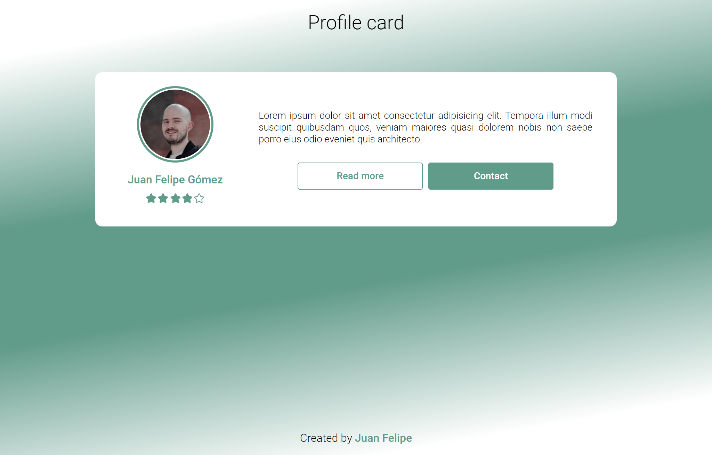

# Profile Card - BEM notation

Building a comoponent following the BEM notation.

## Table of contents

- [Overview](#overview)
  - [The challenge](#the-challenge)
  - [Screenshot](#screenshot)
- [My process](#my-process)
  - [Built with](#built-with)
  - [What I learned](#what-i-learned)
  - [Useful resources](#useful-resources)
- [Author](#author)


## Overview

This exercise was part of the Make It Real bootcamp. The idea is just to create a responsive profile card applying the concepts of CSS flexbox, media queries and responsive patterns.

### The challenge

Use the next image as reference and build a profile card from that


### Screenshot




## My process

### Built with

- Semantic HTML5 markup
- CSS custom properties
- Flexbox
- Mobile-first workflow

### What I learned

Stick the footer to the bottom. 

```css
body {
  min-height: 100vh;
  display: flex;
  flex-direction: column;
}

header {
  flex: 0;
}

main {
  flex: 1;
}

footer {
  flex: 0;
}
```

### Useful resources

- [A Complete Guide to Flexbox](https://css-tricks.com/snippets/css/a-guide-to-flexbox/) - The best flexbox guide ever! This article helped me to remember some flexbox concepts.
- [BEM Methodology - Quick Start](https://en.bem.info/methodology/quick-start/) - This is the BEM Methodology official page. Helped me to review the BEM concepts.
- [Battling BEM CSS: 10 Common Problems And How To Avoid Them](https://www.smashingmagazine.com/2016/06/battling-bem-extended-edition-common-problems-and-how-to-avoid-them/) - I found this article pretty intersting. I didn't read all the article but helped me to solve some questions.

## Author

- Website - [Juan Felipe](https://www.gomezjuanefe.com)